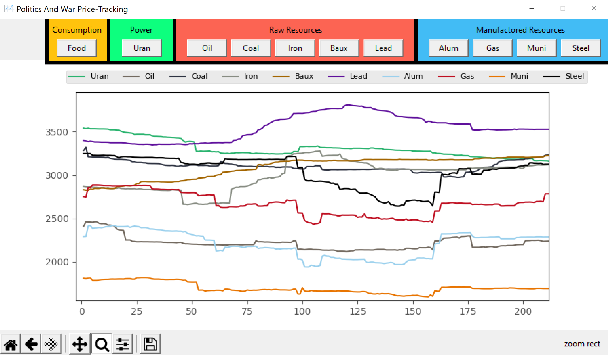
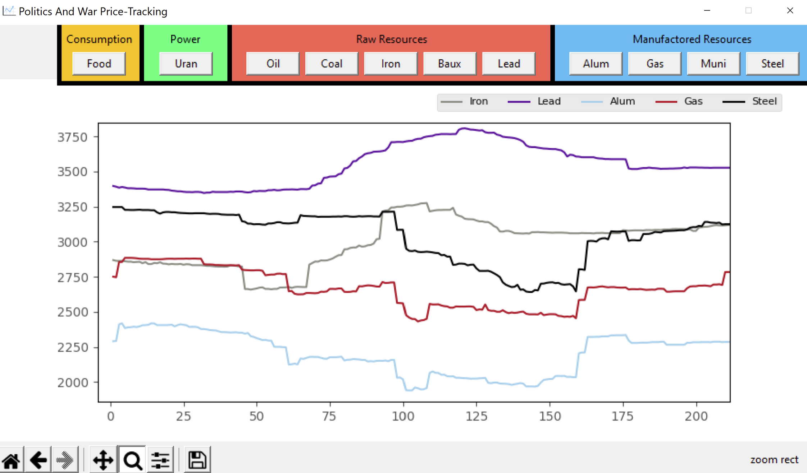
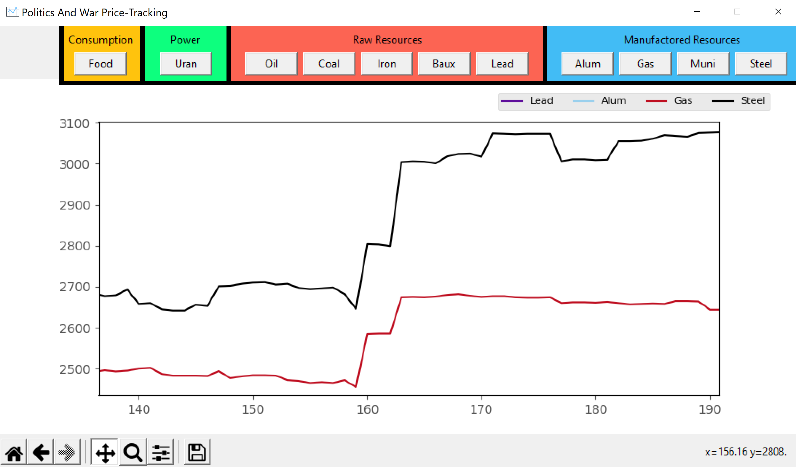

# PnW Market Logger
#### Coded by Tanay Patel
 
 
## What is this?

In this project, I created an application to display live in-game prices of all items in the online game Politics And War.

The way I do this is I execute API requests to obtain the previous 10,000 unique transactions from the PNW server every 30 minutes. I then parsed the JSON data received from the API request and displayed it on a live interactive graph using Python. 

I also averaged all buy and sell transactions, filtered outliers, and stored average price history locally as JSON data for long-term analysis.
 

## Examples of Displayed Data

#### Overview: 

#### Adding/Removing Resources:

#### Zooming and Panning Abilities:

